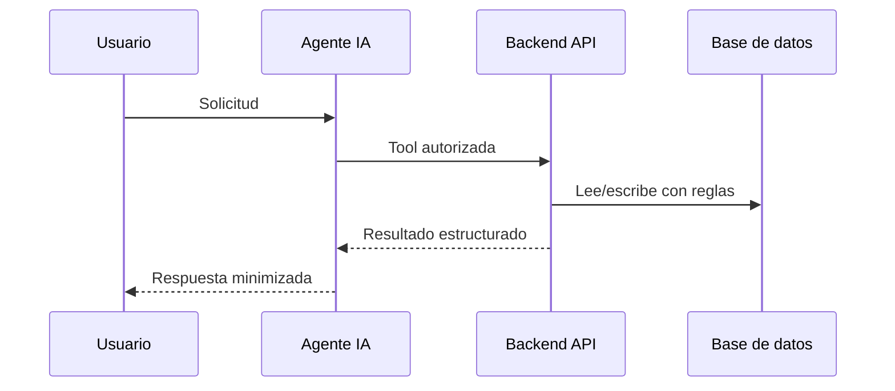

# Enfoque agente IA

## Posicionamiento

El agente es una capa de interaccion y orquestacion. No es fuente de verdad, no decide permisos y no aprueba certificaciones por si mismo.

## Patron

## Reglas

Usar herramientas aprobadas, confirmar escrituras, minimizar datos personales, registrar invocaciones y escalar ambiguedades.
