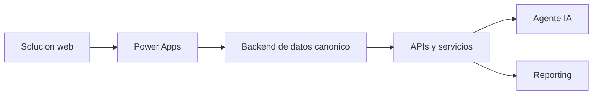

# Vision general

## Contexto

La solucion gestiona certificaciones de colaboradores NTT DATA y evoluciona desde web hacia Power Apps y luego hacia un agente de IA sobre backend gobernado.

## Evolucion

## Objetivos

Vista unica de certificaciones, reduccion de trabajo manual, control de vencimientos, reporting por unidad y proveedor, auditoria y experiencia conversacional segura.

## Exclusiones iniciales

No incluye implementacion productiva, integraciones reales, datos reales, compra de vouchers ni aprobaciones automaticas sin humano.
