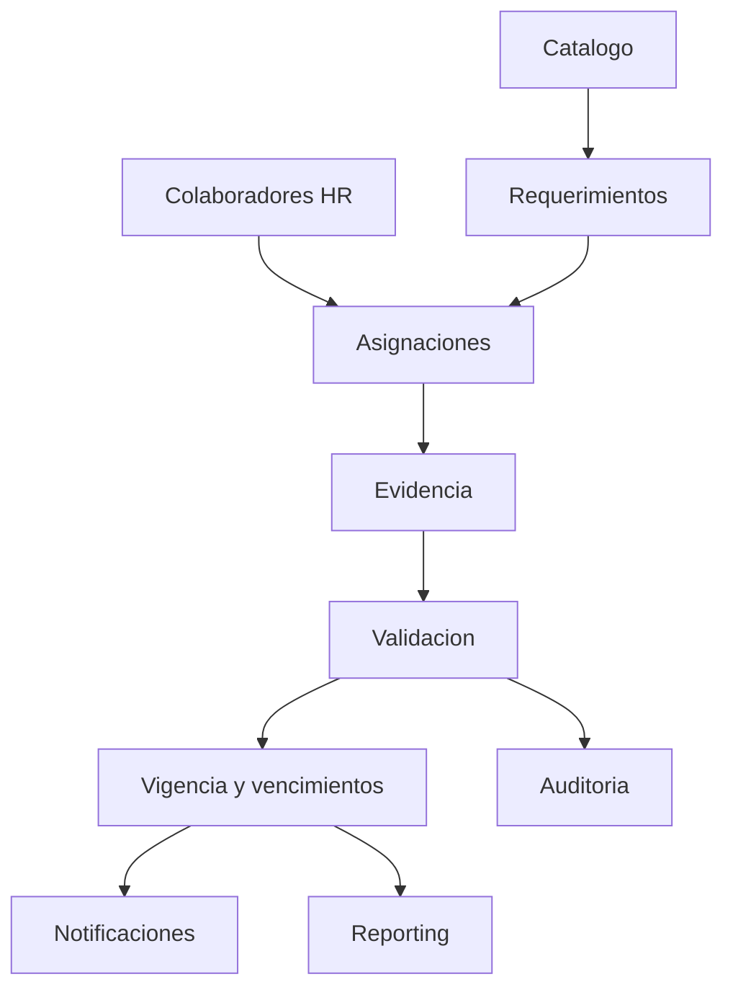

# Procesos de negocio

## Mapa

## Estados

Asignacion: DRAFT, ASSIGNED, IN_PROGRESS, SUBMITTED, COMPLETED, REJECTED, CANCELLED. Registro: REPORTED, PENDING_VALIDATION, VALIDATED, REJECTED, ACTIVE, EXPIRING_SOON, EXPIRED, REVOKED, RENEWED.
