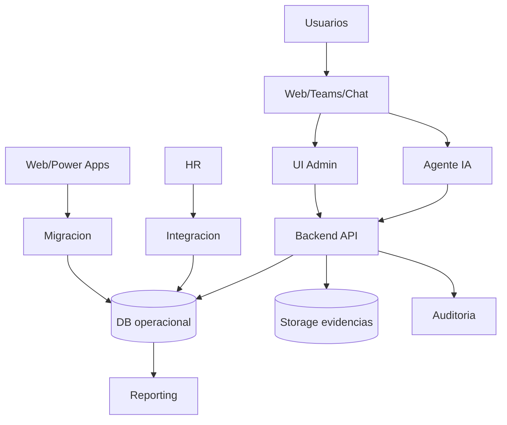

# Arquitectura general

## Vista

```mermaid
flowchart TD
  U[Usuarios] --> CH[Web/Teams/Chat]
  CH --> AG[Agente IA]
  CH --> UI[UI Admin]
  AG --> API[Backend API]
  UI --> API
  API --> DB[(DB operacional)]
  API --> ST[(Storage evidencias)]
  API --> AUD[Auditoria]
  DB --> BI[Reporting]
  HR[HR] --> INT[Integracion]
  INT --> DB
  LEG[Web/Power Apps] --> MIG[Migracion]
  MIG --> DB
```

## Capas

Experiencia, agente, politicas, API, datos, jobs, observabilidad y reporting.
