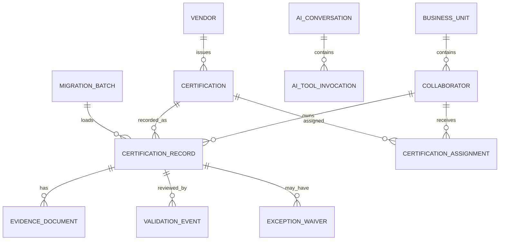

# ERD

```mermaid
erDiagram
  BUSINESS_UNIT ||--o{ COLLABORATOR : contains
  COLLABORATOR ||--o{ CERTIFICATION_RECORD : owns
  COLLABORATOR ||--o{ CERTIFICATION_ASSIGNMENT : receives
  VENDOR ||--o{ CERTIFICATION : issues
  CERTIFICATION ||--o{ CERTIFICATION_RECORD : recorded_as
  CERTIFICATION ||--o{ CERTIFICATION_ASSIGNMENT : assigned
  CERTIFICATION_RECORD ||--o{ EVIDENCE_DOCUMENT : has
  CERTIFICATION_RECORD ||--o{ VALIDATION_EVENT : reviewed_by
  CERTIFICATION_RECORD ||--o{ EXCEPTION_WAIVER : may_have
  AI_CONVERSATION ||--o{ AI_TOOL_INVOCATION : contains
  MIGRATION_BATCH ||--o{ CERTIFICATION_RECORD : loads
```
